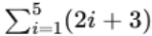
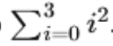
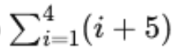
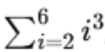

# Aula 2 - Exercícios

### 1. Dado o conjunto de números X = {4, 8, 12, 16}, calcule a média aritmética dos valores.

- Quantidade de valores: 4
- **Média aritmética = (4 + 8 + 12 + 16) / 4 = 10**

### 2. Calcule a média aritmética dos seguintes números: 10, 15, 20, 25, 30. Em seguida, adicione 5 a cada número e calcule a nova média. Qual foi o efeito da adição de 5?

- Quantidade de valores: 5
- **Média aritmética: (10 + 15 + 20 + 25 + 30) / 5 = 20**
- **Nova média aritmética: (15 + 20 + 25 + 30 + 35) / 5 = 25**
- **Efeito:** O valor da média foi aumentado pelo valor adicionado aos valores anteriores.

### 3. Dado o somatório , resolva o somatório e calcule a média dos valores resultantes.

- Quando **i = 1**; (2i + 3) = (2\*1 + 3) = **5**
- Quando **i = 2**; (2i + 3) = (2\*2 + 3) = **7**
- Quando **i = 3**; (2i + 3) = (2\*3 + 3) = **9**
- Quando **i = 4**; (2i + 3) = (2\*4 + 3) = **11**
- Quando **i = 5**; (2i + 3) = (2\*5 + 3) = **13**

Somando todos esses valores:

- **5 + 7 + 9 + 11 + 13 = 45**

Média aritmética

- **45 / 5 = 9**

### 4. Encontre o valor do somatório . Em seguida, calcule a média dos resultados obtidos.

- Quando **i = 0**; x² = 0² = 0
- Quando **i = 1**; x² = 1² = 1
- Quando **i = 2**; x² = 2² = 4

Somando todos esses valores:

- **0 + 1 + 4 = 5**

Média aritmética:

- **5 / 3 = 1.67**

### 5. Em um grupo de 6 alunos, as notas são 6, 7, 8, 9, 10, 5. A média aritmética das notas é calculada. Se a nota do último aluno aumentar 2 pontos, qual será a nova média?

Média aritmética atual:

- **(6 + 7 + 8 + 9 + 10 + 5) / 6 = 7.5**

Nova média aritmética:

- **(6 + 7 + 8 + 9 + 10 + 7) / 6 = 7.84**

### 6. Dado o conjunto de números {3, 7, 11, 15, 19}, multiplique cada número por 2 e calcule a nova média aritmética.

Multiplicando cada item do conjunto, temos:

- 3 \* 2 = 6
- 7 \* 2 = 14
- 11 \* 2 = 22
- 15 \* 2 = 30
- 19 \* 2 = 38

Nova média aritmética:

- **(6 + 14 + 22 + 30 + 38) / 5 = 22**

### 7. Resolva o somatório  e calcule a média dos resultados obtidos.

- Quando **i = 1**; (i + 5) = (1 + 5) = **6**
- Quando **i = 2**; (i + 5) = (2 + 5) = **7**
- Quando **i = 3**; (i + 5) = (3 + 5) = **8**
- Quando **i = 4**; (i + 5) = (4 + 5) = **9**

Somando os valores, temos:

- **6 + 7 + 8 + 9 = 30**

Média dos valores calculados:

- **30 / 4 = 7.5**

### 8. Encontre a média aritmética dos números {18, 22, 25, 31} e verifique o impacto na média se 40 for adicionado ao conjunto.

Soma dos valores:

- **18 + 22 + 25 + 31 = 96**

Média aritmética:

- **96 / 4 = 24**

### 9. Dado o somatório , resolva o somatório e determine a média dos valores.

- Quando **i = 2**; i³ = 2³ = **8**
- Quando **i = 3**; i³ = 3³ = **27**
- Quando **i = 4**; i³ = 4³ = **64**
- Quando **i = 5**; i³ = 5³ = **125**
- Quando **i = 6**; i³ = 6³ = **216**

Somando os valores, temos:

- **8 + 27 + 64 + 125 + 216 = 440**

Calculando a média, temos:

- **440 / 5 = 88**

### 10. Um grupo de cinco pessoas tem idades 20, 25, 30, 35, 40. Calcule a média aritmética das idades. Se duas novas pessoas de idades 50 e 60 forem incluídas, qual será a nova média?

Dado o conjunto atual, podemos calcular a média:

- **20 + 25 + 30 + 35 + 40 = 150**
- **150 / 5 = 30**

Adicionando duas novas pessoas de idades 50 e 60, teremos:

- **{20, 25, 30, 35, 40, 50, 60}**
- **20 + 25 + 30 + 35 + 40 + 50 + 60 = 260**
- **260 / 7 = 37.4**
